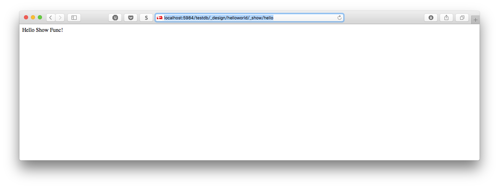
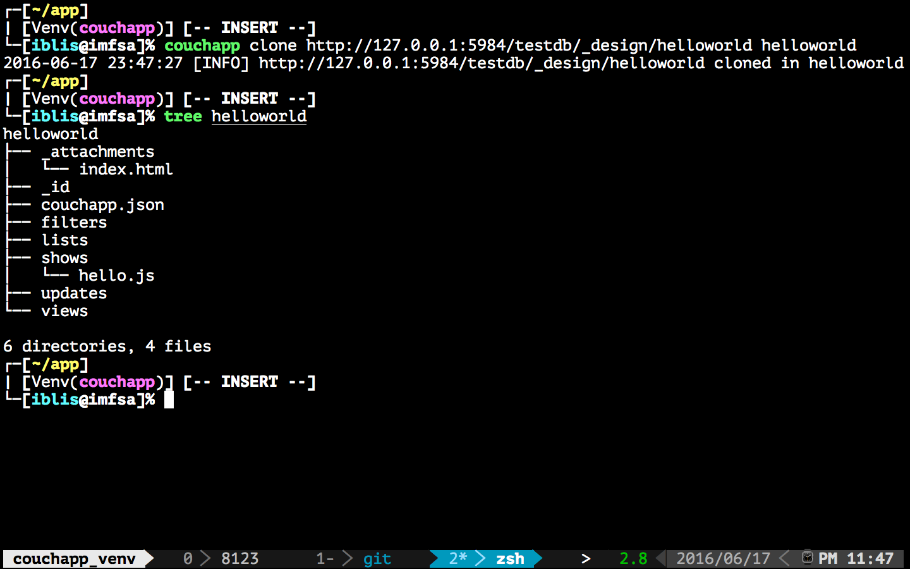

.. _couchapp-tutorial:

Getting Started
===============================================================================

.. toctree::

.. highlight:: shell

In this tutorial you will learn how to create your first CouchApp
(embedded applications in CouchDB_) using the ``couchapp`` script.

Init your application
----------------------------------------------------------------------

``couchapp`` provides you the ``init`` command to initialize your first
CouchApp. It will create an application skeleton by generating needed
folders and files to start. Run::

    $ couchapp init helloworld

.. image:: ../_static/imgs/gettingstarted01.png
    :alt: couchapp init helloworld
    :target: ../_static/imgs/gettingstarted01.png

Add Some Web Pages
----------------------------------------------------------------------

Now we are going to add a index page for our CouchApp.
So we can place the ``index.html`` under ``_attachments``.
CouchDB_ can directly serve our attachments as static files.

An example of ``index.html`` is here:

.. literalinclude:: ../_static/html/gettingstart_index.html
    :language: html

.. image:: ../_static/imgs/gettingstarted02.png
    :alt: add index.html
    :target: ../_static/imgs/gettingstarted02.png

Push your CouchApp
----------------------------------------------------------------------

Now that we have created our basic application,
it's time to ``push`` it to our CouchDB_ server.
Our CouchDB_ server is at the url http://127.0.0.1:5984 and
we want to push our app in the database ``testdb``::

    $ couchapp push testdb

.. image:: ../_static/imgs/gettingstarted03.png
    :alt: couchapp push testdb
    :target: ../_static/imgs/gettingstarted03.png

::

    $ couchapp push

Go on http://127.0.0.1:5984/testdb/_design/helloworld/index.html,
you will see:

.. image:: ../_static/imgs/gettingstarted04.png
    :alt: Hello CouchApp
    :target: ../_static/imgs/gettingstarted04.png

Try out Design Functions
----------------------------------------------------------------------

Now we already make CouchDB_ serve our static files successfully.
What's next? We need to run *server side script*!

Let's try out this attractive feature of CouchDB, `Design Functions
<http://docs.couchdb.org/en/latest/couchapp/ddocs.html>`_.
The following section will demo the ``show`` function.

Create a ``show`` function
++++++++++++++++++++++++++++++++++++++++++++++++++++++++++++

To display our hello we will create a ``show`` function.

::

    $ cd helloworld/
    $ couchapp generate show hello

Here the ``generate`` command create a file named ``hello.js`` in the folder
``shows``. The content of this file is:

.. code-block :: javascript

    function(doc, req) {

    }

which is default template for ``show`` functions.

For now we only want to display the string "Hello World".
Edit your ``show`` function like this:

.. code-block :: javascript

    function(doc, req) {
        return "Hello Show Func";
    }

After we edit those files, we need to ``push`` it again::

    $ couchapp push testdb

Finally, check it on our browser.

http://127.0.0.1:5984/testdb/_design/helloworld/_show/hello

The full doc of ``show`` function is `here
<http://docs.couchdb.org/en/latest/couchapp/ddocs.html#show-functions>`_.
Enjoy it!

Clone your CouchApp
----------------------------------------------------------------------

So your friend just pushed the helloworld app from his computer.
But you want to edit the CouchApp on your own computer.
That's easy, just ``clone`` his application::

    $ couchapp clone http://127.0.0.1:5984/testdb/_design/helloworld helloworld

This command fetch the CouchApp ``helloworld`` from the remote database
of your friend.

Now you can edit the couchapp on your own computer.

.. _CouchDB: http://couchdb.apache.org
